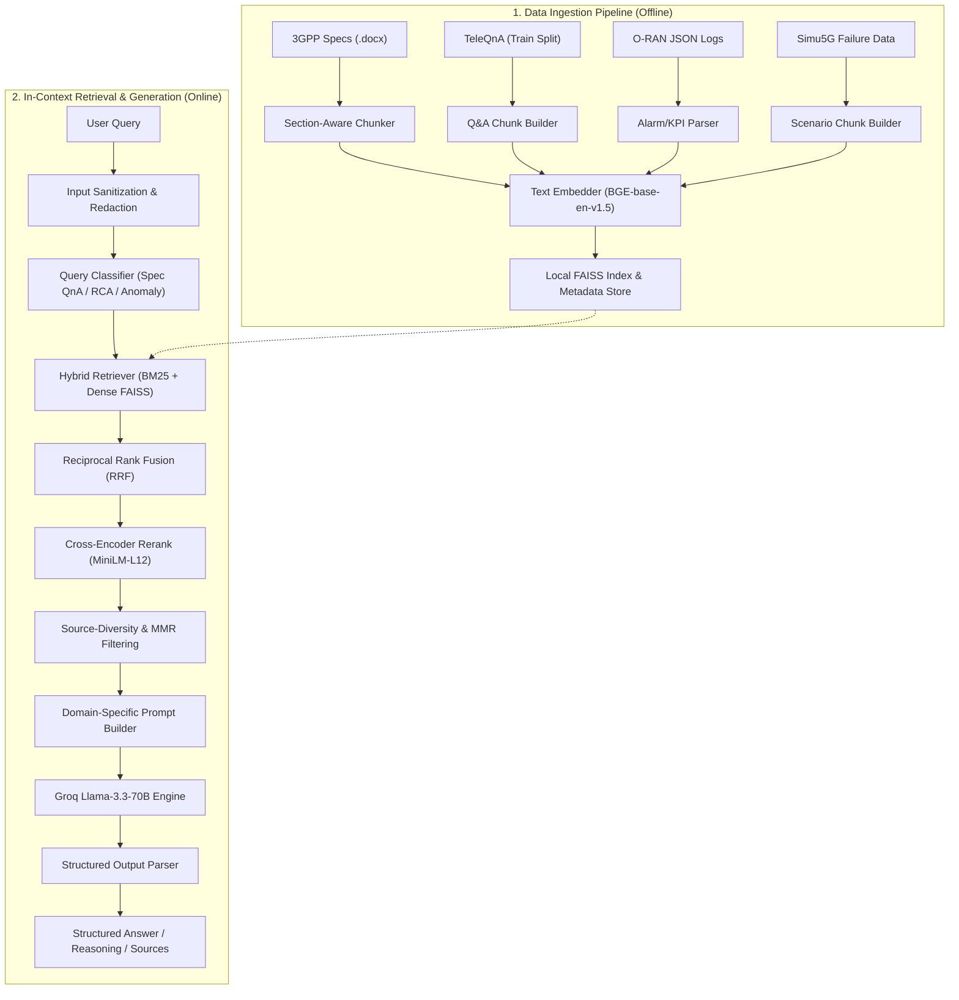

# 📡 Telecom RAN Assistant (Domain-Specific RAG)

[](https://python.org)
[](https://fastapi.tiangolo.com)
[](https://streamlit.io)
[](https://langchain.com)
[](https://huggingface.co)
[](https://github.com/facebookresearch/faiss)
[](https://groq.com)
[](https://www.docker.com)

A domain-specific Retrieval-Augmented Generation (RAG) assistant designed for Telecom Radio Access Networks (RAN). It enables subject matter experts (SMEs) to query complex 3GPP specifications, analyze O-RAN alarm/KPI logs, and trace synthetic 5G failure scenarios (Simu5G) with **grounded, source-cited, and highly explainable responses**.


## Table of Contents
1. [Core Features](#-core-features)
2. [Architecture & Data Flow](#-architecture--data-flow)
3. [Setup & Quick Start](#-setup--quick-start)
4. [Docker Deployment](#-docker-deployment)
5. [Execution Modes](#-execution-modes)
6. [Evaluation & KPIs](#-evaluation--kpis)
7. [Security & Input Sanitization](#-security--input-sanitization)
8. [Troubleshooting Guide](#-troubleshooting-guide)
9. [Project Layout](#-project-layout)


## Core Features
- **Multi-Source Knowledge Fusion**: Integrates 3GPP standards (.docx), TeleQnA multiple-choice questions, O-RAN alarm and KPI logs, and Simu5G scenario failures into a unified index.
- **Section-Aware Processing**: Preserves real section headers during ingestion to output precise citations.
- **Hybrid Search Fusion**: Fuses dense vector embeddings (BGE-base-en-v1.5) with sparse keyword indexes (BM25) using Reciprocal Rank Fusion (RRF) and Cross-Encoder re-ranking.
- **Fail-Safe Generation Fallback**: Automatically degrades to a structured token-overlap passage extraction when API rate limits or expired key errors occur on the LLM client.


## Architecture & Data Flow

The assistant uses local CPU-based retrieval combined with high-speed generation using the Groq API.



* **Local Inference Security:** Document parsing, text chunking, embedding generation, BM25/vector search, and cross-encoder re-ranking run **fully locally on CPU**. Only the final sanitized prompt containing the user query and retrieved public contexts is transmitted to the Groq Cloud API for generation.
* **Explainability First:** Outputs are strictly structured into `ANSWER`, `REASONING`, and `SOURCES` sections, with every claim mapped back to original sections and clauses.

## Setup & Quick Start

### 1. Prerequisites
Ensure you have Python 3.11–3.13 installed.

```bash
# Clone the repository
git clone https://github.com/Ankit-07-chy/RAG-based-Future-Ready-Telecom-RAN-Assistant.git
cd RAG-based-Future-Ready-Telecom-RAN-Assistant

# Install dependencies in a virtual environment
python -m venv .venv
.venv\Scripts\activate      # On Windows
source .venv/bin/activate    # On Linux/macOS
pip install -r requirements.txt
```

### 2. Configure Environment
Create a `.env` file in the root directory:
```env
GROQ_API_KEY=PASTE YOUR API KEY
EMBEDDING_MODEL=BAAI/bge-base-en-v1.5
RERANKER_MODEL=cross-encoder/mmarco-mMiniLMv2-L12-H384-v1
LLM_MODEL=llama-3.3-70b-versatile
```

### 3. Build the Vector Store Index
Index the raw data sources (3GPP `.docx` documents, TeleQnA train split, O-RAN dataset, and Simu5G files) into the FAISS vector database:
```bash
python main.py --mode pipeline
```

## Docker Deployment

The application is containerized with Docker.

### 1. Build and Start Services
Start both services in the background using Docker Compose:
```bash
docker compose up -d --build
```
This builds the python container image, loads variables from `.env`, and maps the directories.

### 2. Available Ports
* **FastAPI API server**: accessible at `http://localhost:8000`
* **Streamlit UI interface**: accessible at `http://localhost:8501`

### 3. Stop Services
```bash
docker compose down
```

## Execution Modes

The assistant supports multiple entry points for operations, testing, and UI integration.

### CLI Query Mode
Interact with the assistant directly from your terminal:
```bash
python main.py --mode query --query "Explain the SIMU5G."
```

### Evaluation Mode
Validate the performance of the RAG assistant against target benchmarks on a held-out TeleQnA test split:
```bash
python main.py --mode eval --max-eval-samples 100
```
Per-question metrics and scoring details are automatically saved in `evals/` and a stable aggregated result is updated in `results/latest_metrics.json`.

### Streamlit Web App
Launch a responsive frontend interface with integrated retrieval inspection and on-the-fly metric logging:
```bash
streamlit run src/streamlit_app.py
```

### REST API Service
Expose endpoints for production integration (defaulting to host `0.0.0.0` at port `8000`):
```bash
python main.py --mode api
```
#### API Contracts
* **POST `/query`**: Runs full retrieval and returns LLM-generated answers.
* **POST `/retrieval`**: Retrieves top-k chunks with fusion scores (useful for search-only UI clients).
* **GET `/health`**: Returns system availability and verification status.

## Evaluation & KPIs

We enforce a credible, defensible evaluation methodology to measure domain performance:
1. **Held-out Corpus Constraint:** The TeleQnA **test split is strictly excluded** from the retrieval corpus, preventing artificial self-retrieval.
2. **Answer Coverage Approximation:** A chunk is considered "answer-bearing" if it contains $\ge 50\%$ of the ground-truth answer's content tokens.
3. **Structured MCQ Accuracy:** Scored based on whether the LLM successfully extracts and chooses the correct multiple-choice option index.

| Metric | Target | Description | Status |
|---|---|---|---|
| **MRR** | $> 75\%$ | Mean Reciprocal Rank of the first answer-bearing chunk | Verified |
| **Top-k Accuracy** | $> 85\%$ | Ratio of queries with relevant chunk present in top-k | Verified |
| **Accuracy** | $> 80\%$ | Multiple choice QnA accuracy | Verified |
| **Recall** | $> 85\%$ | Candidate pool retrieval recall | Verified |
| **Faithfulness** | $> 90\%$ | Groundedness check (LLM-as-judge / token-overlap) | Verified |

## Security & Input Sanitization
The system implements multiple defensive guardrails (`src/security.py`) to protect deployment integrity:
* **Payload Bound Enforcement:** Strict checks on input query length.
* **Character Sanitization:** Removes control characters and strips dangerous symbols.
* **Basic Prompt-Injection Detection:** Sanitizes keywords related to instructions overrides, returning `HTTP 400` on malicious queries.
* **Data Masking:** PII / sensitive identifiers (such as raw IP addresses, email hosts) are masked using the `redact()` module before storage or display.


## Troubleshooting Guide

### 1. Neural Reranker Logit Thresholding
* **Symptom:** Queries return "No relevant information found in knowledge base" even though relevant text exists in the database.
* **Cause:** The Cross-Encoder model outputs raw logits (not normalized between 0 and 1, which are often negative for normal semantic matches). If the config threshold `min_score` is set to `0.0`, semi-relevant or long passages get filtered out.
* **Fix:** Change `min_score` in `config/config.json` and `src/config.py` to `-10.0` (which retains matches for re-ranking).

### 2. LLM Key Expiry / Rate Limit Failure
* **Symptom:** Query returns a 401 error or crashes.
* **Cause:** The Groq API key in `.env` has expired or is blocked.
* **Fix:** The query pipeline automatically detects LLM failure and falls back to a clean, formatted presentation of the top retrieved context chunk. Ensure a fresh key is pasted in `.env` for generative answers.

## Project Layout

```
├── config/
│   └── config.json           # Active hyperparameters, paths, and model selections
├── data/
│   ├── raw/                  # Raw source data (3GPP, TeleQnA, O-RAN, Simu5G)
│   └── vectorstore/          # Local persisted FAISS index files
├── evals/                    # Audit logs and per-question evaluation CSV records
├── results/                  # Latest aggregate performance metric logs
├── src/
│   ├── config.py             # Configuration manager & paths declaration
│   ├── parse_*.py            # Source parsers (3GPP docx, TeleQnA, O-RAN logs, Simu5G)
│   ├── hybrid_retrieval.py   # Keyword BM25 + dense FAISS fusion retrieval
│   ├── reranker.py           # Cross-encoder MiniLM neural re-ranking
│   ├── retrieval_filters.py  # MMR & source diversity filters
│   ├── llm_engine.py         # Groq LLM & Local QLoRA engine abstractions
│   ├── rag_chain.py          # Query execution flow & prompt assembly
│   ├── pipeline.py           # Offline vectorstore ingestion pipeline orchestrator
│   └── api.py                # FastAPI endpoints and serve hooks
└── main.py                   # Global CLI orchestrator entrypoint
```
